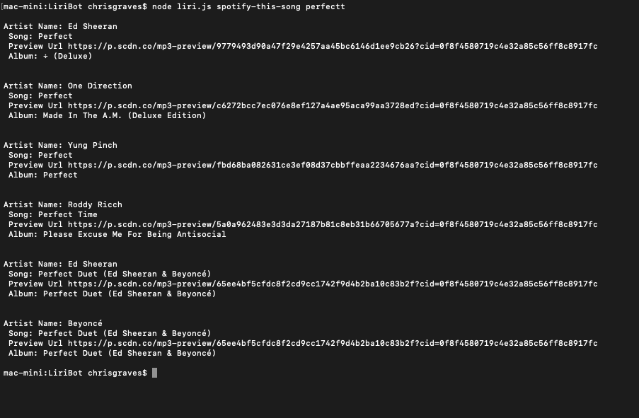
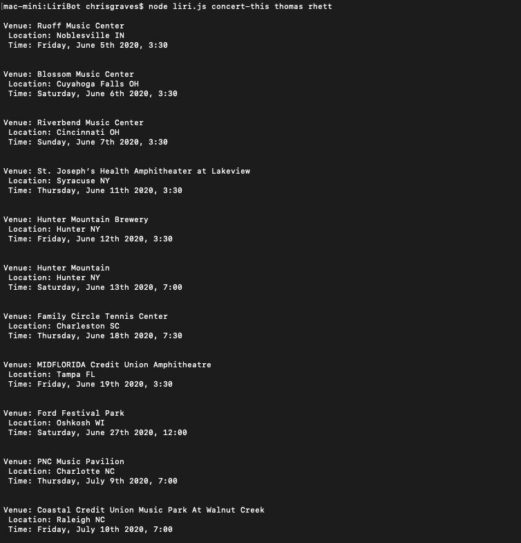
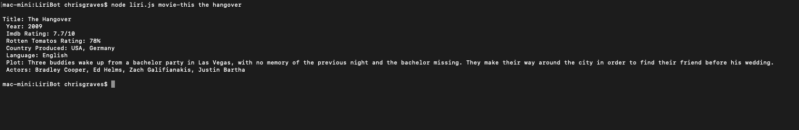
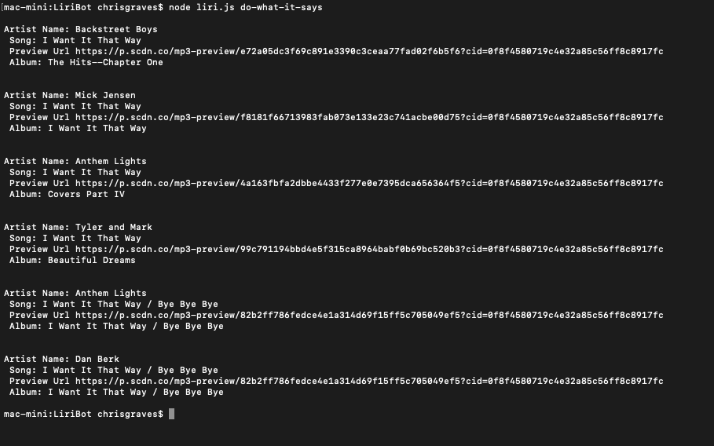

# LiriBot
Version 1.0.0

## App Rundown
Liri bot is a CLI App performing a language Interpretation and Recognition Interfaceapp using apis powered by spotify api, ombd api and bandsintown api.

The app is run by passing in user arguments from the terminal/command prompt, depending on the users request the program will execute one of 4 functions based on a conditional outline in the begining of the script. 

Each function has a clear outline on how to decipher the object that is returned from the selected api, and returning the user a readable format of the object.

## Packages, Node, API Keys
In order to run the liriBot you need to add your own spotify api id and secert ,OMBD api keys and bandsInTown api keys in a .env file.
This app runs on Node.js so confirm node.js has been installed
You will also need to install the following npm packages:
- node spotify api
- axios
- moment
- dotenv

## Running the App
- Confirm that the packages have been installed into the correct folder this can be viewed in the package.json.
- Opening up the terminal/command prompt cd into the correct folder of the app.
- run $ node liri.js followed by one of the following below:

- ### spotify-this-song [song name]
- ### concert-this [artist name]
- ### movie-this [movie name]

## Screen Shots of working CLI APP

